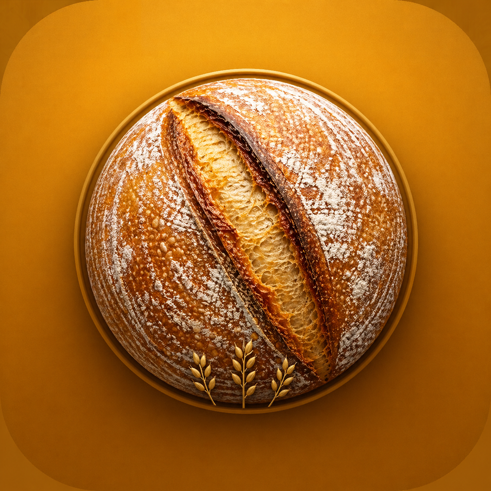
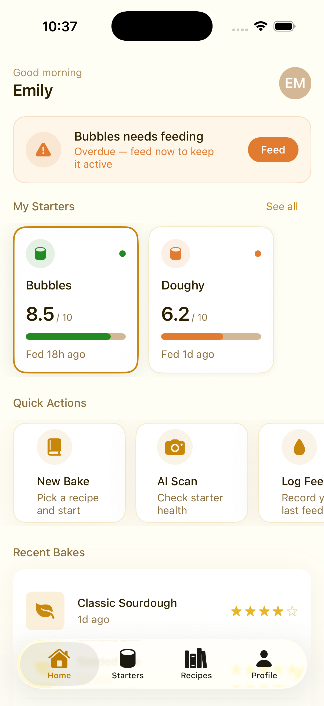
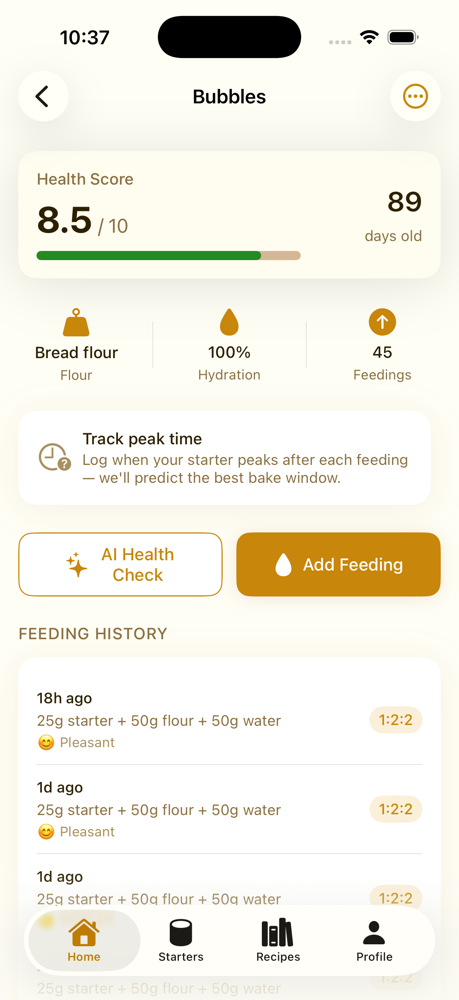
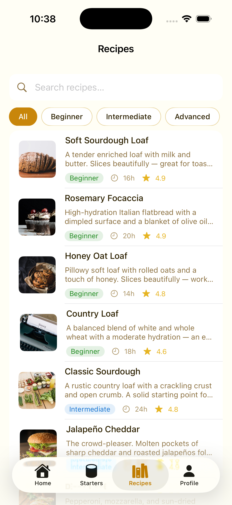
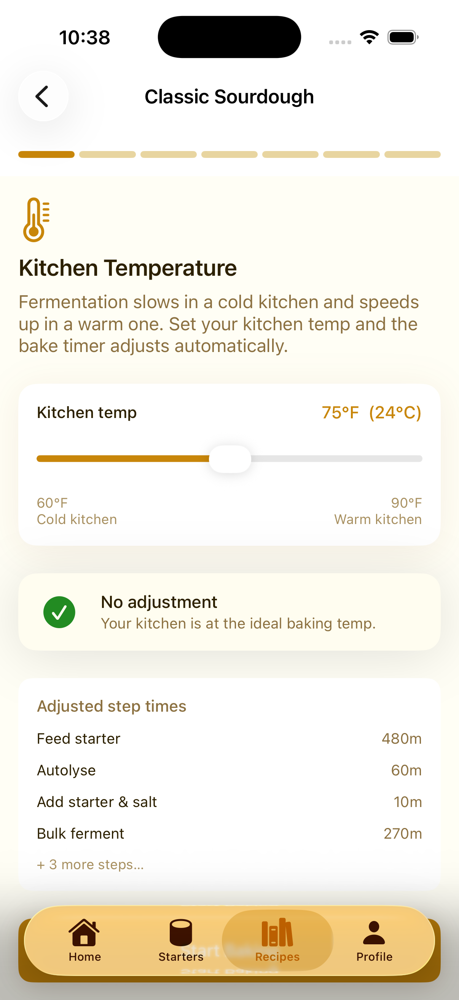
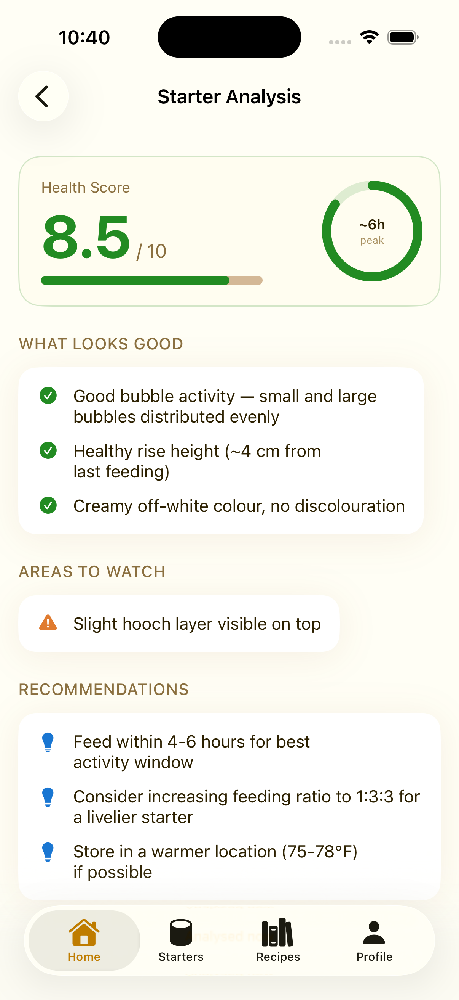
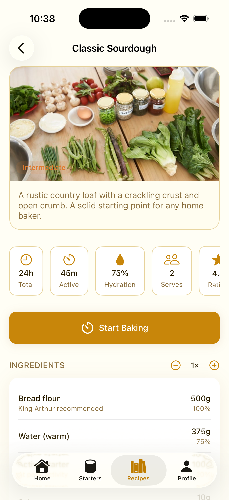
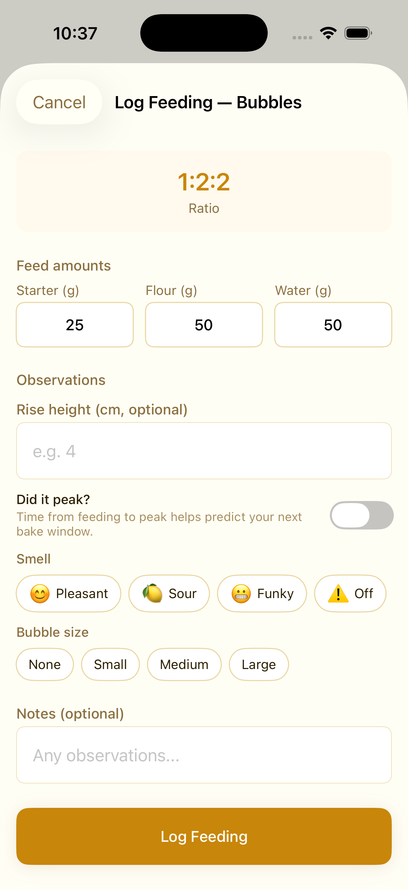
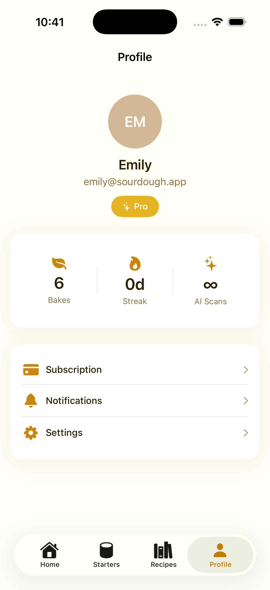

<div align="center">



# SourdoughPro

**The intelligent sourdough companion for serious home bakers.**

[](https://github.com/beckettech/SourdoughPro)
[](https://developer.apple.com/ios/)
[](https://swift.org)
[](https://developer.apple.com/xcode/swiftui/)
[](https://github.com/beckettech/SourdoughPro/actions)

<br/>

[](https://github.com/beckettech/SourdoughPro)

> **🚧 Coming soon to the Apple App Store.** Active development — features shown below reflect the current build. ⭐ Star this repo to get notified at launch.

[Features](#-features) · [Tech Stack](#-tech-stack) · [Roadmap](#-roadmap)

---

</div>

## 📱 Features

<table>
  <tr>
    <td align="center">
      <br/>
      <b>Home</b>
    </td>
    <td align="center">
      <br/>
      <b>Starter Detail</b>
    </td>
    <td align="center">
      <br/>
      <b>Recipe Library</b>
    </td>
    <td align="center">
      <br/>
      <b>Bake Timer</b>
    </td>
  </tr>
  <tr>
    <td align="center">
      <br/>
      <b>AI Analysis</b>
    </td>
    <td align="center">
      <br/>
      <b>Recipe Detail</b>
    </td>
    <td align="center">
      <br/>
      <b>Log a Feeding</b>
    </td>
    <td align="center">
      <br/>
      <b>Profile & Stats</b>
    </td>
  </tr>
</table>

---

## The Problem

Sourdough baking has a 35% abandonment rate among beginners — not because it's hard, but because the feedback loop is broken. Bakers can't tell if their starter is ready, don't know why their loaf went flat, and have no way to learn from one bake to the next. Existing apps are either glorified timers or cookbook readers. **SourdoughPro is neither.**

---

## ✨ Features

### 🫙 Starter Intelligence
Track every feeding, measure rise height, note smell and bubble activity — then let the app compute a live **health score out of 10**. A color-coded readiness banner tells you *exactly* when your starter peaks so you never waste a batch.

<table>
  <tr>
    <td align="center"><b>Starter Dashboard</b><br/>Health score · Peak prediction · 45-day feeding log</td>
    <td align="center"><b>Multi-Starter Support</b><br/>Bubbles (bread flour, 8.5/10) · Gerty (whole-wheat, 6.2/10) — each with its own schedule</td>
    <td align="center"><b>Feeding Reminders</b><br/>Local notifications that reschedule automatically after every feed</td>
  </tr>
</table>

### 🍞 Recipe Library — 18 Curated Recipes
Sorted by difficulty, filterable by flour type, searchable across name, summary and tags. Every recipe includes a baker's-percentage ingredient list with a **live scale factor** (0.5× → 4×) and a step-by-step timeline you actually follow during the bake.

| Beginner | Intermediate | Advanced |
|---|---|---|
| Rosemary Focaccia | Classic Sourdough | Sourdough Bagels |
| Soft Sourdough Loaf | Jalapeño Cheddar | Chocolate Cherry |
| Pizza Loaf | Seeded Rye | Walnut Cranberry |
| Honey Oat Loaf | Country Loaf | Baguette |
| … | … | … |

### ⏱ Temperature-Adjusted Bake Timer
Sourdough timing is *temperature-dependent*. The bake timer applies `factor = 2^((24−T)/10)` in real time — if your kitchen is 18°C the bulk ferment extends automatically; at 28°C it shortens. Step times update live as you drag the slider. All display in **°F** (primary) with °C shown alongside.

### 🤖 AI Crumb & Starter Analysis
Point your camera at your starter jar or your finished loaf. GPT-4o Vision scores fermentation activity, crumb structure, shaping, and bake — then returns specific improvement recommendations. Works offline with the mock engine; drops in your OpenAI key for real results.

```
Health score:   8.5 / 10
Crumb structure: Open  ·  Fermentation: 8  ·  Shaping: 7  ·  Bake: 8

✓  Good bubble activity — small and large bubbles distributed evenly
✓  Nice ear on the score — strong oven spring
⚠  Extend bulk ferment by 30 min for more openness
```

### 💰 Discard Calculator
Never throw starter away uninformed. The discard calculator shows exactly how much to keep, discard, and add — plus five discard recipe ideas (crackers, waffles, pizza dough…) based on what you have.

### 👤 Pro Tier
- Unlimited AI scans (free tier: 3/month)
- Full recipe library (free tier: 5 recipes)
- Advanced analytics & bake history export
- Priority email support

---

## 🏗 Tech Stack

| Layer | Technology |
|---|---|
| **Language** | Swift 5.9 |
| **UI** | SwiftUI (MVVM, `@Observable` / `ObservableObject`) |
| **Persistence** | Codable + `JSONFileStore` (SwiftData migration planned) |
| **AI Vision** | OpenAI GPT-4o Vision API (`/v1/chat/completions`) |
| **Auth** | Supabase Auth (stub ready, wire with env key) |
| **Subscriptions** | RevenueCat (stub ready) |
| **Notifications** | `UNUserNotificationCenter` — local only |
| **CI** | GitHub Actions — build + test on every push |
| **Min Deployment** | iOS 17 |

### Architecture

```
SourdoughPro/
├── App/            # @main, AppCoordinator, AppState
├── Core/
│   ├── DesignSystem/   # Token-only system: SDColor, SDFont, SDSpace, SDRadius
│   ├── Components/     # SDButton, SDCard, SDTextField, SDChip, SDProgressBar…
│   ├── Network/        # APIClient (pluggable base URL)
│   └── Services/       # Protocol + Mock + Real stubs (swap via build flag)
├── Models/         # Starter, Feeding, Recipe, BakeSession, Analysis, User
├── Features/       # One folder per feature; each screen owns its ViewModel
├── MockData/       # Rich fixtures — 2 starters, 18 recipes, 6 bakes, AI results
└── Shared/         # Date extensions, BakersPercentage math, FeedingScheduler
```

Every `Service` is a protocol. Debug builds use `MockXxxService` (fully offline). Flipping `USE_REAL_SERVICES` in build settings surfaces the Supabase / OpenAI / RevenueCat implementations.

---

## 📊 Market Opportunity

| Signal | Data |
|---|---|
| Sourdough baking interest | Up **300%** since 2020 (Google Trends) |
| US home bakers | ~90 million, with ~15M active sourdough bakers |
| Top sourdough app (App Store) | 4.2★ — no AI features, timer-only |
| Target TAM | $85M (enthusiast baker apps + AI food tools) |
| Monetisation | Freemium — $4.99/mo Pro · $9.99/mo Baker |

---

## 🗺 Roadmap

**v1.0 — App Store Launch**
- [x] Starter tracking & health scoring
- [x] 18-recipe library with scaling
- [x] Temperature-adjusted bake timer
- [x] AI crumb & starter analysis (GPT-4o Vision)
- [x] Discard calculator
- [x] Local feeding reminders
- [ ] App Store screenshots & metadata
- [ ] RevenueCat subscription wiring
- [ ] Supabase auth (optional — local-first ships first)
- [ ] **Submit to Apple App Store** 🍎

**v1.5 — Depth**
- [ ] Swift Charts activity sparkline on starter detail
- [ ] "What went wrong?" troubleshooter mode
- [ ] Visual bulk-ferment guide (poke test, volume illustrations)
- [ ] Voice-guided baking via AVSpeechSynthesizer
- [ ] Apple Watch feeding reminder complication

**v2.0 — Community**
- [ ] Cloud sync & multi-device via Supabase
- [ ] Community recipe sharing
- [ ] Baker streaks & achievements feed
- [ ] iPad split-view layout

---

## 📄 License

MIT — see [LICENSE](LICENSE) for details.

---

<div align="center">

🚧 **Active development** — App Store launch coming soon.

[](https://github.com/beckettech/SourdoughPro)

Made with 🍞 and a lot of patience.

**[⭐ Star this repo](https://github.com/beckettech/SourdoughPro)** to follow along.

</div>
